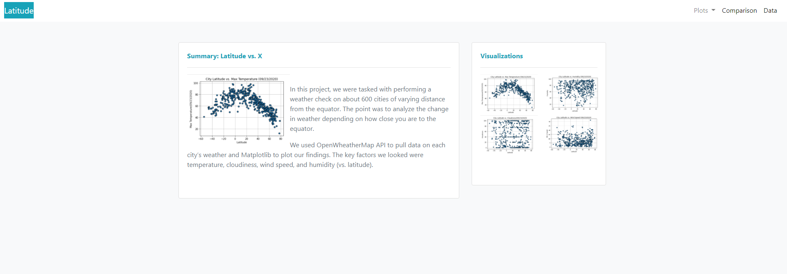
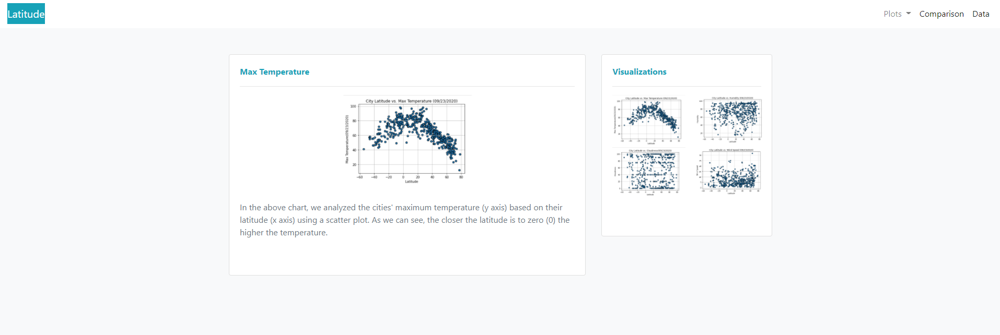
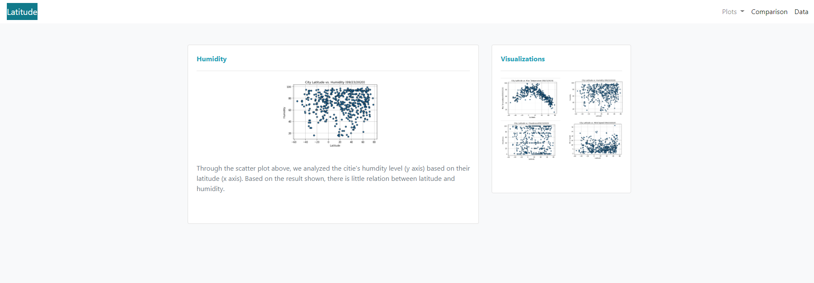
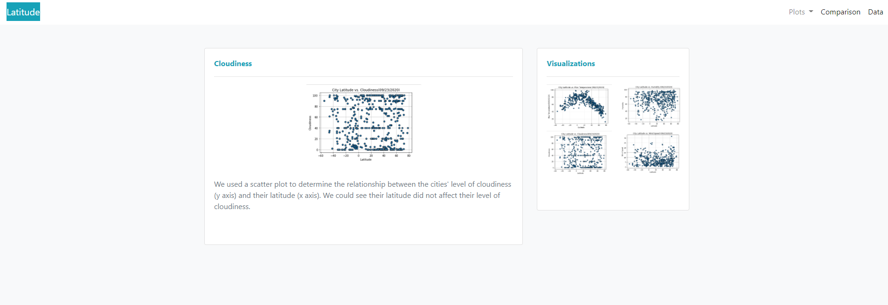
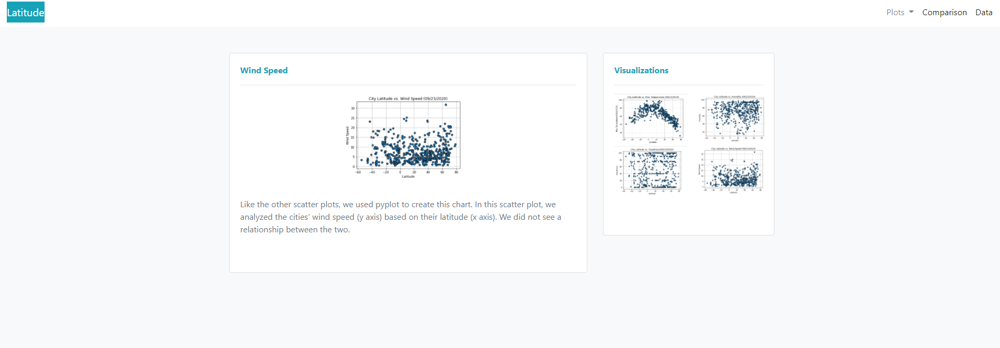
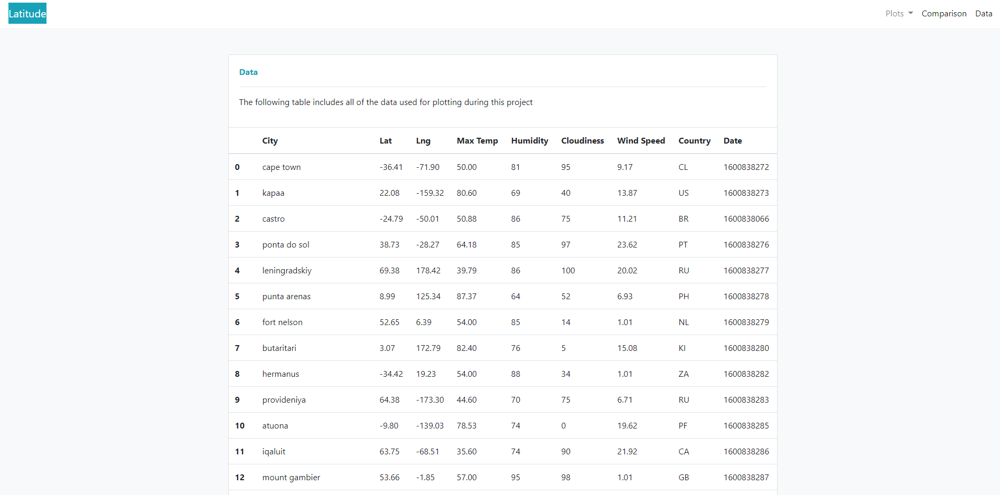

# Web-Design-Challenge

Created a visualization dashboard website using visualizations I've created for the Weather Map study.

The website consists of 7 pages:

1 LANDING PAGE:
 -  With an explanation of the project and links to each visualization pages.

 

4 VISUALIZATION PAGES:
-   Each contains [A descriptive title and heading tag, the plot/visualization itself for the selected comparison, A paragraph describing the plot and its significance]

1 COMPARISON PAGE:
-   With all of the visualizations on the same page.

1 DATA PAGE
-   With a responsive table containing the data used in the visualizations.

